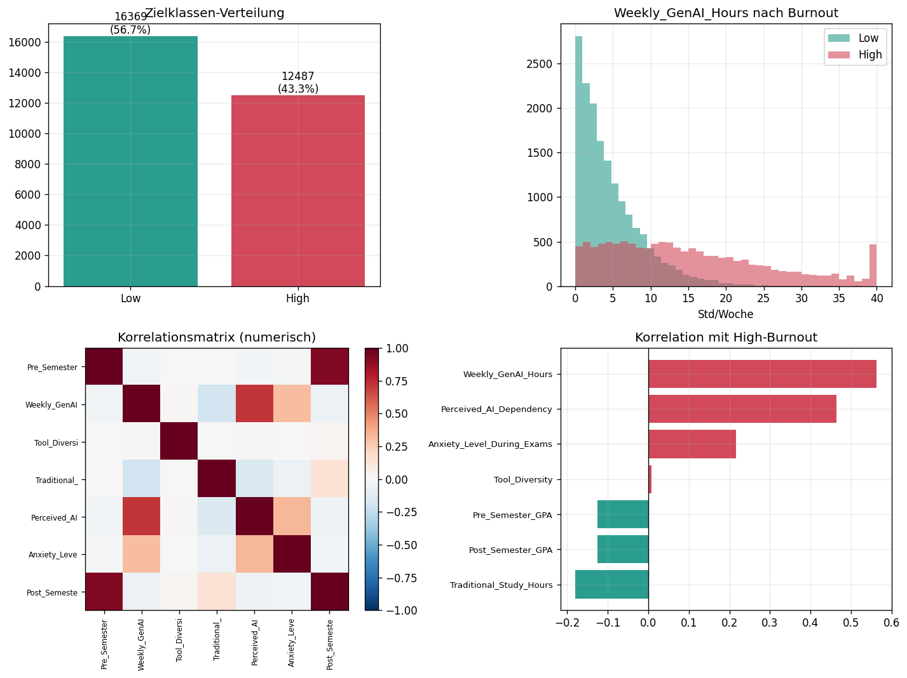
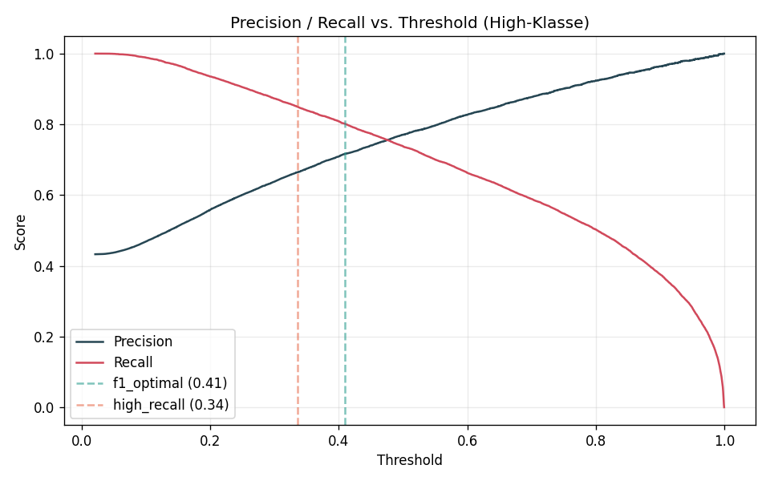

# Student Burnout Risk Classification

## Overview

This project implements a binary classification of students' burnout risk
(`High` / `Low`) based on their generative-AI usage and other study-related
features. It provides a complete, reproducible machine-learning pipeline with
data-quality checks, model comparison, threshold optimization, and evaluation.

## Explainer Video

A short, student-friendly explainer walks through the project, the data, and
the modeling approach.

<video src="https://github.com/JoHendel/student-burnout-classification/releases/download/v1.0/Burnout-Risiko_durch_KI.mp4" controls width="640"></video>

> If the video does not play inline, download or watch it on the project's
> [Releases page](https://github.com/JoHendel/student-burnout-classification/releases/tag/v1.0).

## Project Goal

The goal is to identify at-risk students as reliably as possible. The use case
is preventive: correctly detecting students who are actually at risk (high
recall of the `High` class) matters more than maximizing overall accuracy. The
pipeline therefore optimizes the classification threshold toward this goal.

## Dataset

- **Source:** [AI Impact on Students](https://www.kaggle.com/datasets/dspritom/ai-impact-on-students) (Kaggle)
- **Size:** 28,856 rows, 15 columns
- **Target variable:** `Burnout_Risk_Level` (`High` / `Low`)
- **Class distribution:** 57 % `Low`, 43 % `High` (mildly imbalanced)

The dataset contains no missing values and no duplicates. The `Student_ID`
column is a pure identifier and is removed before training.

Most relevant features: `Weekly_GenAI_Hours`, `Perceived_AI_Dependency`,
`Traditional_Study_Hours`, `Anxiety_Level_During_Exams`, `Pre_Semester_GPA`,
`Post_Semester_GPA`, and the categorical variables `Major_Category`,
`Year_of_Study`, `Primary_Use_Case`, `Prompt_Engineering_Skill`,
`Paid_Subscription`, and `Institutional_Policy`.

For licensing and size reasons the dataset is not shipped with the repository
(see `.gitignore`). It must be downloaded from Kaggle and placed in the `data/`
directory before running the pipeline.

## Approach

The pipeline runs through the following steps:

1. Load the data and check data quality (missing values, duplicates, class
   distribution).
2. Preprocessing inside a `scikit-learn` pipeline (one-hot encoding for
   categorical features, standardization for numerical features).
3. Model comparison using 5-fold stratified cross-validation.
4. Threshold optimization toward the recall of the `High` class.
5. Final evaluation, plot generation, and saving of the model and the selected
   threshold.

## Exploratory Data Analysis

The strongest associations with a high burnout risk are found for:

- `Weekly_GenAI_Hours` (correlation r = +0.56)
- `Perceived_AI_Dependency` (r = +0.46)

In this dataset, higher generative-AI usage goes hand in hand with lower
traditional study time. Further relevant features are the year of study
(`Year_of_Study`) and a strict institutional usage policy
(`Institutional_Policy = Strict_Ban`).



*Figure 1: Overview of the exploratory data analysis. Top left, the
distribution of the target classes (57 % Low, 43 % High); top right, the
distribution of weekly generative-AI usage split by burnout class; bottom, the
correlations of the numerical features with each other and with burnout risk.
Clearly visible: generative-AI usage separates the two classes most strongly.*

## Machine-Learning Approach

Three models are compared:

- **Logistic Regression** (baseline, interpretable)
- **Random Forest** (non-linear, robust)
- **XGBoost** (gradient boosting)

Preprocessing happens inside the pipeline, which prevents data leakage between
the cross-validation folds. Model selection is based on the mean ROC-AUC from
5-fold stratified cross-validation.

The classification threshold is determined from out-of-fold probabilities on
the training data, not on the test set. This avoids optimistically biased
results.

## Results

Model comparison (test split and 5-fold cross-validation):

| Model                | Accuracy | F1    | ROC-AUC | CV-AUC (5-fold)   |
| -------------------- | -------- | ----- | ------- | ----------------- |
| Logistic Regression  | 0.790    | 0.748 | 0.864   | 0.865 ± 0.003     |
| Random Forest        | 0.783    | 0.721 | 0.853   | 0.859 ± 0.004     |
| XGBoost              | 0.789    | 0.732 | 0.861   | 0.863 ± 0.004     |

Selected model: **Logistic Regression**. It delivers performance comparable to
XGBoost while being interpretable and computationally cheaper. The low variance
of the cross-validation indicates no overfitting.

Threshold optimization for the `High` class:

| Threshold            | Precision | Recall (High) | F1    | Missed cases |
| -------------------- | --------- | ------------- | ----- | ------------ |
| Standard 0.50        | 0.780     | 0.718         | 0.748 | 705          |
| F1-optimal 0.41      | 0.729     | 0.786         | 0.756 | 535          |
| High-recall 0.34     | 0.680     | 0.839         | 0.751 | 402          |

The standard threshold misses about 28 % of at-risk students. With the
high-recall threshold, the share of detected cases rises to roughly 84 %, at
correspondingly lower precision.



*Figure 2: Precision and recall of the High class as a function of the
classification threshold. A lower threshold increases recall (more at-risk
students are detected) but reduces precision (more false alarms). The dashed
lines mark the F1-optimal threshold (0.41) and the high-recall threshold (0.34)
chosen for the preventive use case.*

## Project Structure

```
student-burnout-classification/
├── src/
│   └── burnout_pipeline.py      # Full pipeline (load → model → threshold)
├── data/                        # Place the CSV here (not included in the repo)
├── plots/                       # Figures embedded in this README (EDA, threshold)
├── requirements.txt
├── LICENSE
└── README.md
```

## Installation

```bash
pip install -r requirements.txt
```

Then download the dataset from Kaggle and place the CSV file in the `data/`
directory:
[https://www.kaggle.com/datasets/dspritom/ai-impact-on-students](https://www.kaggle.com/datasets/dspritom/ai-impact-on-students)

On macOS, XGBoost requires the OpenMP runtime. If you see a `libomp.dylib`
error, install it with `brew install libomp`.

## Usage

```bash
python src/burnout_pipeline.py
```

Output:

- Model comparison and evaluation in the console
- Figure `plots/threshold_tradeoff.png`
- Trained model `burnout_model.joblib`
- Recommended threshold `threshold.json`

## Reproducibility

- Fixed random seed (`RANDOM_STATE = 42`) for split, cross-validation, and
  models
- Stratified 80/20 split and 5-fold stratified cross-validation
- Full preprocessing inside the pipeline
- Threshold determined exclusively on the training data

It was verified that removing `Post_Semester_GPA` does not change the CV-AUC
(0.863); no data leakage through this feature could be detected.

## Limitations

- The dataset is remarkably clean (no missing values, no duplicates) and most
  likely synthetic. It is suitable for practice and demonstration purposes but
  does not allow causal conclusions about real students.
- Correlation does not imply causation. High generative-AI usage may be a
  symptom rather than a cause.
- The model weights the year of study strongly. In a real deployment this
  carries the risk of disadvantaging specific groups.

## Future Work

- SHAP analysis for directional feature explanations
- Feature engineering, e.g. ratio of generative-AI time to study time, or GPA
  difference
- Removing `Tool_Diversity` (correlation close to zero)
- Hyperparameter optimization for XGBoost

## Technologies Used

- Python
- pandas, NumPy
- scikit-learn
- XGBoost
- matplotlib
- joblib

Exact minimum versions are pinned in `requirements.txt`.

## Note on Supporting Tools

AI tools were used to support the planning, structuring, and documentation of
this project. The technical review, adaptation, and final implementation were
carried out independently.

## License

[MIT](LICENSE)
